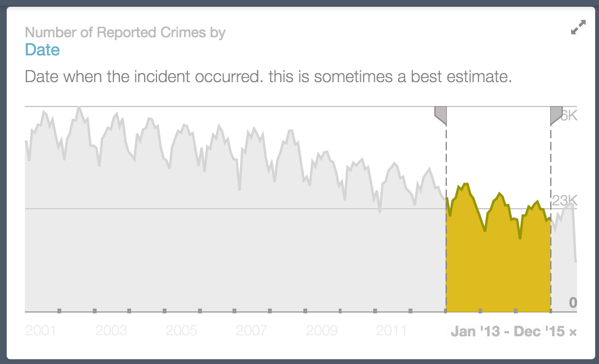
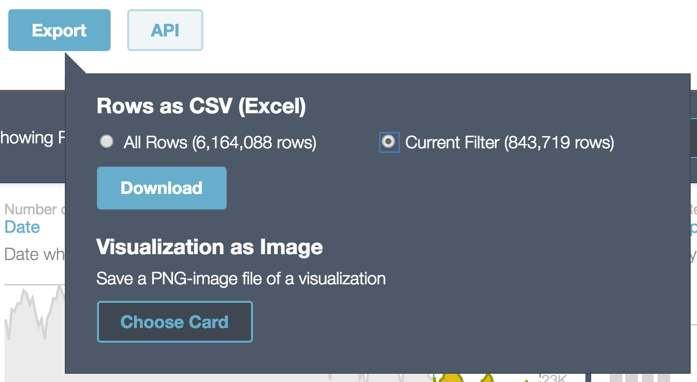

# Assignment 1: Welcome to the Command Line   

This assignment is due Wednesday October 5 at 1:30am.  A computer will collect it -- not me.  So don't be late!!

### Preliminaries/Setup
Please see the [preliminary instructions](preliminaries.md) for running the terminal, python, and a text editor.

You can then join this assignment [here](https://classroom.github.com/assignment-invitations/8cfa1521ab98e0dfb7341771721f793b).  You'll get an email telling you that the import is complete.
* Open the Terminal and navigate (`cd`) to whatever directory (folder) you want to work from.  The choice of directory is up to you -- just as you'd save the documents for any other class.
* Issue ```git clone git@github.com:harris-ippp/hw-1-UserName.git``` (replacing `Username` by your GitHub user name), to download the directory.
* Now `cd` into the directory and get to work!

## Downloading some data.

In class, we played with the city salaries file.  You can re-retrieve that file via:

```
curl data.cityofchicago.org/api/views/xzkq-xp2w/rows.csv -s -o salaries.csv
```

Let's also grab some crime data.

* Go to the data portal for the City of Chicago, and navigate to "Crimes - 2001 to present"
  * You can find it here: https://data.cityofchicago.org/view/5cd6-ry5g
* We'll look at the last three full years of data, 2013-2015.  Highlight it as shown in the picture below.
* Now click on "Export." Then under "Rows as CSV," select "Current Filter (843,726 rows)".  (Don't worry if it goes up by a few, before the assignment is over: it seems not to be totally stable.)  Then "Download" (see second picture).  It's about 200 MB, so ... wait!
* (Yes, there are neat tools for doing your homework, on the website.  But we'll start from the beginning and go further.
* If this whole data grab is not working, just click this [link](https://data.cityofchicago.org/api/views/6zsd-86xi/rows.csv?accessType=DOWNLOAD&bom=true&query=select+*+where+%60date%60+%3E%3D+%272013-01-01T00%3A00%3A00%27+AND+%60date%60+%3C+%272016-01-01T00%3A00%3A00%27).
* Move this file to your homework directory, naming it as you like (I call mine chicago_crime.csv).

We'll soon learn to grab these resources programmatically.  But it's already a start to get comfortable grabbing datasets from the wonderful Chicago Data Portal!

## Most Excellent Exercises!

You now have chicago_crime.csv and salaries.csv in your homework directory.  There are several scripts, `police_officers.sh`, `police_names.sh`, `detectives.sh`, and `homicide.sh`.  These have structures for each of the questions below, which you'll fill out.  Open these files with Atom; then one step at a time replace the `cat` commands on each line, to complete the scripts.  (See [salaries.sh](https://github.com/harris-ippp/01-welcome/blob/master/salaries.sh) for an example.)  When you're done, fill in SOLUTIONS, as directed.  

So: you will modify the files in the directory, and then send it back to GitHub.  Since you've made a copy of the repository by accepting the assignment, all of your work will be separate and will not interfere with your classmates.  We will see your edited files (provided that you uploaded them on git), and you can check this too, by navigating to your own repository on your GitHub page. 

### Highest Salaries

* The question you already answered in class: who makes the most?

### Police Officers of the City of Chicago

* How many police officers are there in Chicago?
* How many of them are detectives?
* What is the most common names of police officers?  What do you notice?

### Crime, in particular first degree murders.

Based on the 2013-2015 data:

* What hour of the day (1AM, 3PM, 00AM?) are the most first degree murders in Chicago?
* What is the bloodiest month for Chicago?
* What was the bloodist single day?
* Where are the most people killed (vacant lot? tavern?  stairwell?  house?  alley?)?

(Apologies, I realized after-the-fact that this may be a bit dark.)

When you're all done, commit and push the code:
```
git add SOLUTIONS *sh  # add the relevant files
git status # check that all your modified files are listed
git commit -m "phewff, all done!"
git push
```
Just make sure it's in before Wednesday October 5th at 1:30am!

### Helpful Readings
* Python: [Think Python](http://proquestcombo.safaribooksonline.com.proxy.uchicago.edu/book/programming/python/9781449332006) (Downey), Chapters 1, 2, 10, and 11.  For an alternative take, consult chapters 1-5 of the official [Python Tutorial](https://docs.python.org/3/tutorial/index.html).
* Git: [Hello World](https://guides.github.com/activities/hello-world/), GitHub Guides.

### Suggested Readings
* Data and Technology in Government: [Innovative State](https://smile.amazon.com/Innovative-State-Aneesh-Chopra/dp/0802121349/) (Aneesh Chopra), and [The Responsive City](https://smile.amazon.com/Responsive-City-Communities-Data-Smart-Governance-ebook/dp/B00MQTIA3M/) (Stephen Goldsmith and Susan Crawford).


### Pictures for Data Portal



